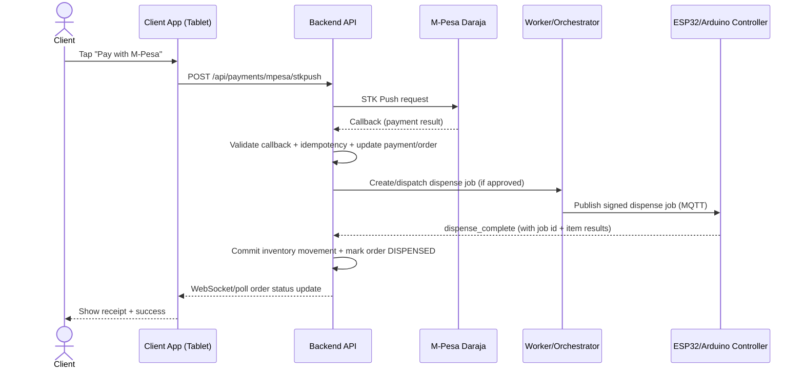

# Client & Pharmacist Interface Spec (Smart Vending Pharmacy - Kenya)

## Assumptions / MVP UI constraints
- Target device: Android tablet in kiosk mode (React Native + Tablet UI layout rules).
- OTC-only vending: UI must clearly communicate limitations and always fall back to pharmacist consultation when policy requires it.
- The backend is the source of truth; the frontend reflects order/payment/dispense state via API polling and/or WebSockets.

## Technology for UI (implementation choice)
- Frontend: **React Native (TypeScript)** for the client kiosk + pharmacist dashboard web app later.
- Real-time updates: **WebSockets** (Socket.IO style) for order status and pharmacist consultation events.

---

## Screen-by-screen flow (Client)

```mermaid
flowchart TD
  A[Landing Screen] --> B[Product Selection Screen]
  B --> C{Call/Chat Pharmacist?}
  C -->|No| D[Cart & Checkout Screen]
  C -->|Yes| E[Pharmacist Consultation Screen]
  E --> F[Recommended Products (from Pharmacist)]
  F --> D[Cart & Checkout Screen]
  D --> G[Payment via M-Pesa STK Push]
  G --> H{Payment verified?}
  H -->|No| I[Payment Failure / Retry]
  H -->|Yes| J{Pharmacist approval required?}
  J -->|No| K[Backend Dispatches to Machine]
  J -->|Yes| L[Wait for Pharmacist Approval]
  L --> K[Backend Dispatches to Machine]
  K --> M[Dispensing in Progress]
  M --> N[Receipt / Success]
```

---

## Screen 1: Landing Screen

### Purpose
- Let clients quickly choose an OTC category.

### UI layout (tablet-first)
- Top header: system name + small disclaimer text:
  - “OTC-only vending. For severe symptoms, visit a clinician.”
- Grid of categories (2–3 columns depending on tablet width):
  - Pain
  - Stomach
  - Cold/Flu
  - Allergy
  - Feminine Care
  - Sexual Health
  - First Aid
  - Convenience Items

### Suggested UI components
- `CategoryGrid` (large tappable tiles)
- `DisclaimerBanner` (small, persistent)
- `SafeAreaView` + responsive scaling rules

### API calls
- `GET /api/client/categories`
  - Returns list of categories with `id`, `displayName`, `iconKey`, `sortOrder`.

---

## Screen 2: Product Selection Screen

### Purpose
- Client selects a category.
- Optionally enters symptoms/what they are ailing from.
- System suggests OTC products and client builds a cart.

### UI layout
1. Category selector (top chips or segmented control)
2. Symptoms text input (optional)
3. Suggestions list (product cards)
4. Cart preview (bottom sheet or right-side panel for tablet)

### Suggested UI components
- `CategoryChips`
- `SymptomTextInput` (multi-line)
- `SuggestionList`:
  - `ProductCard` (medicine name, strength/pack size, price, “Add” button)
  - `RequiresPharmacistReviewBadge` (if policy flags the SKU)
- `CartPanel`:
  - cart item rows with `qty stepper`
  - `Remove` button per item
  - shows subtotal
- `CallPharmacistButton` (optional, persistent at bottom)

### API calls
1. Product suggestions
   - `POST /api/otc/suggestions`
   - Request:
     ```json
     {
       "categoryId": "uuid",
       "symptomsText": "string (optional)",
       "clientPhone": "string (optional)"
     }
     ```
   - Response:
     ```json
     {
       "suggestions": [
         {
           "medicineSkuId": "uuid",
           "name": "string",
           "packSize": "string",
           "unitPriceCents": 5000,
           "requiresPharmacistReview": true,
           "confidence": 0.74,
           "policyRationale": "string"
         }
       ],
       "serverDisclaimer": "string"
     }
     ```

2. Add item to cart
   - `POST /api/carts/{cartId}/items`
   - Request:
     ```json
     { "medicineSkuId": "uuid", "qty": 1 }
     ```
   - Response: updated `cart` summary

3. Remove item from cart
   - `DELETE /api/carts/{cartId}/items/{medicineSkuId}`
   - Response: updated `cart` summary

4. Create cart (first time a client starts)
   - `POST /api/carts`
   - Request:
     ```json
     { "machineId": "uuid", "clientPhone": "string (optional)" }
     ```
   - Response:
     ```json
     { "cartId": "uuid" }
     ```

### Event sequence (user action -> suggestion -> cart update)
1. User selects category and types symptoms (optional).
2. Frontend calls `POST /api/otc/suggestions`.
3. Backend returns ranked OTC SKUs filtered to policy.
4. User taps “Add” on a `ProductCard`.
5. Frontend calls cart item endpoint; UI updates subtotal immediately using response.

---

## Screen 3: Pharmacist Consultation (Optional)

### Purpose
- Client can “Call/Chat with Pharmacist”.
- After consultation, recommended products can be added to the cart.

### MVP approach (fastest)
- Start with **chat** (no video yet).
- Keep an optional video toggle placeholder in UI.

### UI layout
- Header:
  - “Pharmacist Consultation”
  - “Connected / Connecting”
  - “End session”
- Chat body: messages list + typing indicator
- Recommendations section (once pharmacist responds):
  - `ProductCard` variants with `Add to cart` button

### Suggested UI components
- `ChatTranscript`
- `MessageInput`
- `CallStatusPill`
- `RecommendedProductCards`
- `VideoCallPlaceholder` (optional)

### API calls
1. Start consultation session (links to the order/cart context)
   - `POST /api/pharmacist/consultations/start`
   - Request:
     ```json
     { "cartId": "uuid", "clientPhone": "string", "symptomsText": "string (optional)" }
     ```
   - Response:
     ```json
     { "consultationId": "uuid", "wsRoom": "string" }
     ```
2. Send pharmacist advice events (chat)
   - WebSocket: `consultation:{consultationId}:message`
3. Pharmacist recommendation delivery
   - WebSocket: `consultation:{consultationId}:recommendations`
4. Add pharmacist-recommended items to cart (same cart endpoints as Screen 2)
   - `POST /api/carts/{cartId}/items`

### Backend gating behavior (policy)
- Pharmacist can recommend items; the backend still enforces:
  - payment verification before dispensing
  - inventory lot selection with expiry-aware dispensing

---

## Screen 4: Cart & Checkout Screen

### Purpose
- Show selected products and total price.
- Collect payment phone number.
- Initiate M-Pesa STK push.
- Show payment success/failure.
- Reflect dispensing progress.

### UI layout (tablet-first)
1. Cart item list (name, qty, price)
2. Total amount (big, prominent)
3. Phone number input (or hidden if already known)
4. CTA button: `Pay with M-Pesa`
5. Payment status area:
   - “Awaiting M-Pesa confirmation…”
   - “Payment verified. Preparing dispense…”
   - “Waiting for pharmacist approval…” (only if required)
   - “Dispensing in progress…”
6. Receipt section after completion:
   - order id, items, timestamp, machine location

### Suggested UI components
- `CartSummaryPanel`
- `TotalAmountCard`
- `PhoneNumberInput`
- `PrimaryButton` (`Pay with M-Pesa`)
- `StatusStepper` (4 steps)
- `ReceiptView`
- `RetryButton`

### API calls
1. Create order from cart (checkout)
   - `POST /api/carts/{cartId}/checkout`
   - Request:
     ```json
     { "symptomsText": "string (optional)", "clientPhone": "string" }
     ```
   - Response:
     ```json
     {
       "orderId": "uuid",
       "paymentRequired": true,
       "requiresPharmacistApproval": false
     }
     ```

2. Initiate M-Pesa STK push
   - `POST /api/payments/mpesa/stkpush`
   - Request:
     ```json
     { "orderId": "uuid", "phone": "2547xxxxxxxx" }
     ```
   - Response:
     ```json
     { "paymentId": "uuid", "checkoutRequestId": "string" }
     ```

3. Get order status (polling fallback)
   - `GET /api/orders/{orderId}/status`

4. (Optional) Frontend does not trigger dispense directly in the happy path.
   - Backend automatically dispatches when payment is verified and pharmacist approval gating is satisfied.
   - For debugging/manual operations:
     - `POST /api/internal/orders/{orderId}/dispatch` (admin-only, internal)

### Event sequence (checkout -> payment -> dispense -> receipt)



---

## Pharmacist Dashboard UI Spec (queue + approval)

### Purpose
- Receive consultation requests.
- Approve or reject dispensing.
- Optionally view chat transcript and recommend OTC SKUs.

### Suggested dashboard screens
1. `RequestsQueue`
2. `RequestDetails` (symptoms, cart/order items)
3. `ApprovalModal` (select approved items and quantities)

### Suggested UI components
- `RequestsTable` (filter by `OPEN`, newest first)
- `RequestCard` with client phone + risk flags
- `ItemApprovalList` (SKU checkboxes + qty stepper)
- `DecisionButtons`:
  - `Approve`
  - `Reject`
- `ChatPanel` (real-time transcript)

### API calls (pharmacist)
1. Fetch open requests
   - `GET /api/pharmacist/requests?status=OPEN`
2. Approve a request
   - `POST /api/pharmacist/requests/{requestId}/approve`
   - Request:
     ```json
     {
       "approvedItems": [
         { "medicineSkuId": "uuid", "qty": 1 }
       ],
       "notes": "string (optional)"
     }
     ```
3. Reject a request
   - `POST /api/pharmacist/requests/{requestId}/reject`
   - Request:
     ```json
     { "notes": "string (optional)" }
     ```

### Real-time updates
- WebSocket channels:
  - `pharmacist:requests` (new requests + status changes)
  - `consultation:{consultationId}:message`
  - `consultation:{consultationId}:recommendations`

---

## UI/UX compliance copy (must be shown)
- “This is OTC vending. If symptoms are severe or worsening, seek clinical care.”
- If pharmacist approval is required:
  - “A pharmacist must review your request before dispensing.”
- After payment:
  - “Please keep your phone with you until dispensing finishes.”

